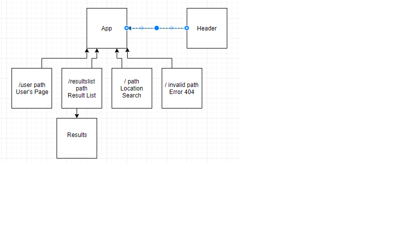

# _Capstone Planning_

#### _This project will begin planning and building my capstone project to showcase what I have learned while enrolled at Epicodus.  07/13/18_

#### By _**Jimmy McNamara**_

## Description

_This project will build plan the layout for my capstone project.  Planned capstone project is a website/app that takes 2 locations and finds a spot somewhere in the middle for them to meet. Middle points can be filtered and sorted by type of activity that is in between. This project will build a static model of the site and will identify where state will live. Once the capstone project idea is finalized, this section will be updated._
_Project’s Purpose or Goal: Project will allow users to search for attractions or things to do that are located halfway, or close to halfway between 2 geographic locations.  Halfway is measured in time of travel, not miles._

_List the absolute minimum features the project requires to meet this purpose or goal:_
_-Allow 2 users to authenticate their locations._
_-Show driving directions for each user to reach a spot close to equidistant from both starting locations._
_-Provide a list of suggestions for things to do at or close to the meeting spot._

_What tools, frameworks, libraries, APIs, modules and/or other resources (whatever is specific to your track, and your language) will you use to create this MVP? List them all here. Be specific._
_-Google Maps API_
_-Google Places API_
_-Google Routes API_
_-React_
_-Redux_

_If you finish developing the minimum viable product (MVP) with time to spare, what will you work on next? Describe these features here: Be specific._
_-Allow users to change their mode of travel to the meeting location._
_-Allow users to filter and sort their list of results by their specific interests._
_-Allow for multiple starting locations to be used if more than 2 people are meeting._

## Planned Component Structure

## Project Specs

_User should be able to enter 2 locations they are searching for and have the api locate them._
_Once locations are entered, a location halfway should be generated._
_The meeting location should give directions to reach it for each starting location._
_Attractions close to the meeting location should be given._
_Users can filter and sort the attractions based on their interests._
_More than 2 starting locations can be entered to find the equidistant meeting location for._
_Users can change the type of transportation they will be taking to the meeting point._
_User can sign in and mark when locations they have met at and rank them._
_Users can keep their rankings private or share them publicly._
_Users can look back at their meeting locations history._
_Search results can be tailored to a user's profile based on their visited history and rankings._

## Setup/Installation Requirements

* _Clone repository from GitHub_
* _In the terminal run 'npm install' to setup install the different dependencies and node modules indicated in the package.json file._

## Known Bugs

_No known bugs as of now._

## Support and contact details

_Contact Jimmy McNamara with any questions or comments_

## Technologies Used

_JavaScript_
_React_
_Redux_
_CSS_
_HTML_
_Google Maps API_
_Google Places API_
_Google Routes API_

### License

*Licensed through the MIT open resource agreement*

Copyright (c) 2018 **_Jimmy McNamara_**
